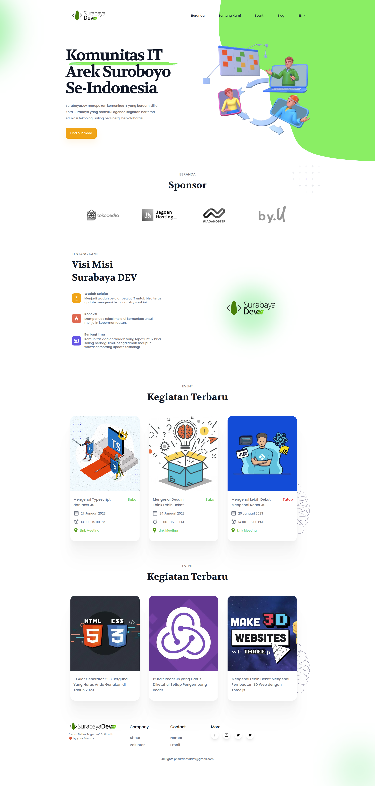
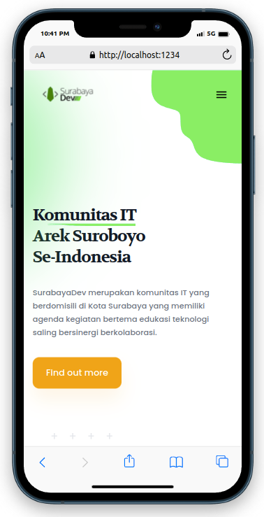
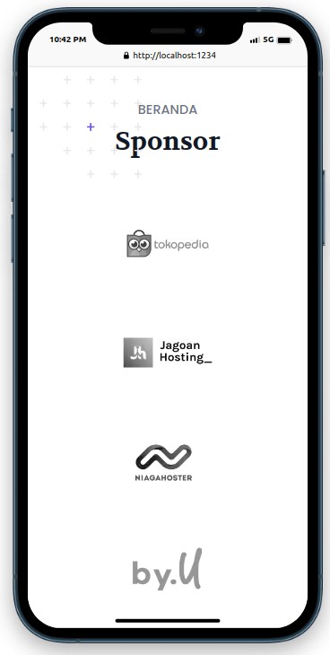
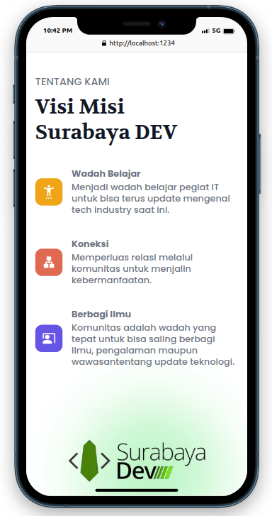
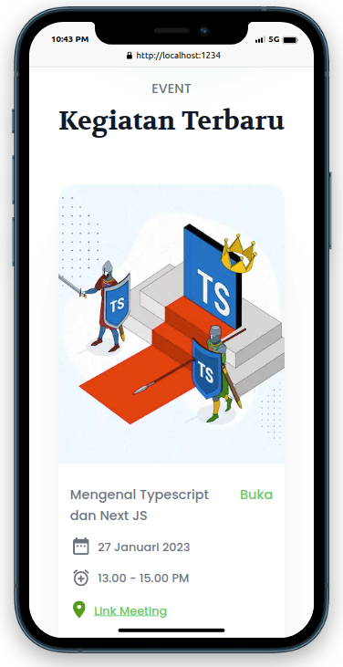
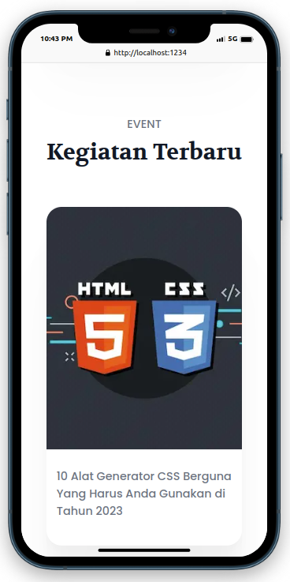
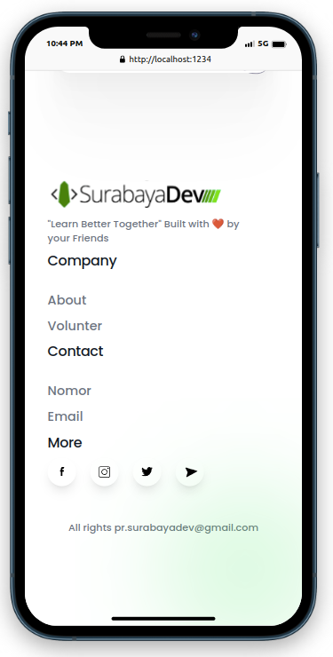

# LANDINGPAGE SURABAYADEV
<div align="center">
  <h2> Teknologi : 🔋 typescript-nextjs-tailwind</h2>
  <hr>
  <p>Project penugasan volunter anggota Dev SurabayaDev</p>
  <p>SurabayaDev merupakan komunitas IT yang berdomisili di Kota Surabaya yang memiliki agenda kegiatan bertema edukasi teknologi saling bersinergi berkolaborasi.</p>

[](https://github.com/ahmadsoni/Landingpage-SurabayaDev)
[](https://depfu.com/ahmadsoni/Landingpage-SurabayaDev?project_id=30160)
</div>

<hr>
# Fitur
Repositori ini 🔋 dikemas dengan baterai:

- ⚡️ Next.js 13
- ⚛️ React 18
- ✨ TypeScript
- 💨 Tailwind CSS 3 
- 📈 Reusable Component Dengan Atomic Design
- 🤖 Meta tag
## Cara Menjalankan

### 1. Clone landing page ini menggunakan cara berikut:
You can start the server using this command:

```bash
git clone https://github.com/ahmadsoni/Landingpage-SurabayaDev.git
```
### 2. NPM install:
```bash
npm install
```
### 3. Run program :
```bash
npm run dev
```
### 3. Buka Link Local :
👉 http://localhost:1234/ 👈 

<hr>
## Link Akses Dan Preview

   👉 https://surabayadev.vercel.app/ 👈 

   👉 🔥 Versi Desktop
    <div align="center">
    
    </div>
    👉 🔥 Versi Mobile
    <div align="center">
    
    
    
    
    
    
    </div>